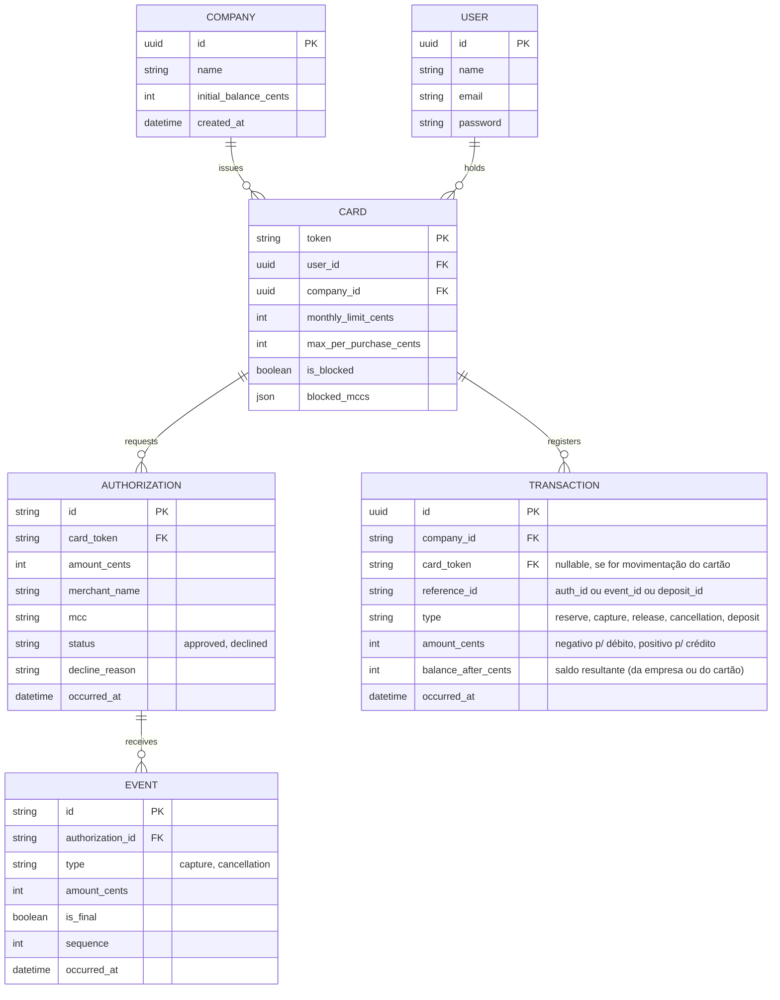

# MODEL.md

Este arquivo é o coração da sua entrega. Escreva-o durante o desafio, não depois.

## 1. O modelo

Diagrama (Mermaid ou imagem) e, para cada coisa que existe nele, uma linha dizendo por que ela existe.

1.   **Company**: Representa a empresa Acme, controlando o saldo geral
     disponível e emitindo cartões para seus funcionários.

2.   **User**: Armazena os dados de autenticação e perfil dos portadores dos
     cartões e da gestora financeira (Marina).

3.   **Card**: Define as regras contratuais e de limite de cada funcionário
     (teto por compra, limite mensal, status de bloqueio e MCCs
     restritos).

    4. **Authorization**: Registra a intenção de compra enviada pela rede,

    garantindo idempotência e guardando o status da decisão e o motivo
    de recusa.

    5. **Event**: Captura eventos assíncronos enviados pela rede (capturas
    parciais/totais ou cancelamentos) vinculados a uma autorização
    prévia.

    5. **Transaction** (Ledger): O livro-razão imutável (Append-Only) que registra cada movimentação financeira, servindo de base para calcular o saldo e o extrato retroativo.

## 2. Decisões

De três a cinco. Para cada uma: o que você decidiu, a alternativa que rejeitou, e o motivo.

## 2. Decisões

1.  **Ledger Imutável com Transações Compensatórias**

    - _O que foi decidido:_ Uma autorização aprovada gera um lançamento de reserva (`reserve`). A captura gera uma liberação da reserva antiga (`release`) combinada com o lançamento efetivo do gasto (`capture`), sem nunca alterar registros passados.

    - _Alternativa rejeitada:_ Atualizar colunas de saldo diretamente na tabela `Card` via SQL `UPDATE`.

    - _Motivo:_ Preserva a imutabilidade exigida pela Etapa 3 ("uma transaction registrada não é alterada nem apagada"), garantindo trilha de auditoria e capacidade de recalcular o extrato retroativamente.

2.  **Idempotência via Persistência Atômica no Banco (Isolada do Domínio)**

    - _O que foi decidido:_ A regra de domínio valida se o identificador (`id`) da autorização ou evento já existe. A garantia de unicidade atômica e idempotência contra requisições simultâneas da rede será feita na camada de infraestrutura utilizando a restrição de chave primária/única no PostgreSQL (com o Redis disponível no template podendo ser usado opcionalmente para cache/rate-limit, mas mantendo o core do domínio totalmente puro e independente de driver de cache).

    - _Alternativa rejeitada:_ Confiar exclusivamente em validações em memória ou locks do Redis para evitar duplicidade financeira.

    - _Motivo:_ O banco relacional é a fonte da verdade para transações financeiras; chaves únicas na tabela de Authorizations/Events impedem race conditions sem acoplar a regra de negócio ao Redis.

3.  **Bloqueio Pessimista para Concorrência (S3)**

    - _O que foi decidido:_ Uso de transações de banco de dados com `lockForUpdate()` na tabela de cartões durante a validação de limite e saldo.

    - _Alternativa rejeitada:_ Processamento assíncrono via filas (Queue/Jobs).

    - _Motivo:_ A API da rede exige resposta síncrona em até 2 segundos, tornando filas incompatíveis com o fluxo de decisão imediata no caixa.

4.  **Aprovação com Alerta em Capturas com Tolerância (MCCs 7011, 5812, 5541)**

    - _O que foi decidido:_ Capturas que excedam o valor autorizado dentro do limite técnico de tolerância de 20% serão aprovadas e registradas no ledger.

    - _Alternativa rejeitada:_ Rejeitar com `422` qualquer captura que divirja do valor exato da autorização.

    - _Motivo:_ Segue a diretriz de desempate do desafio ("na dúvida, aprove e registre o alerta. Bloquear alguém no caixa é a última opção") e respeita o fato de que a rede não reenvia erros `4xx`.

## 3. O que eu esperava dos cenários

Antes de implementar, para S2, S4 e S5: o resultado que você espera e por quê. Depois de rodar: bateu? O que mudou?

-    **S2 (Testes de Recusa):**

    -   _Expectativa:_ Ana no MCC 7995 (`mcc_blocked`), Ana acima de R$ 800 (`amount_exceeds_transaction_limit`), Carla (`card_blocked`) e token inválido (`card_not_found`) devem ser estritamente recusados (`declined`).

    -   _Resultado após rodar:_ (A preencher após execução dos testes).

- **S4 (Capturas Múltiplas e Tolerância MCC 7011):**

    - _Expectativa:_ As três capturas (300 + 300 + 260 = 860) sobre uma autorização de 800 serão aceitas progressivamente, consumindo as reservas e aplicando o total dentro da tolerância de 20% permitida para o MCC 7011.

    - _Resultado após rodar:_ (A preencher após execução dos testes).

- **S5 (Edge Cases de Rede):**

    - _Expectativa:_ Captura chegando antes da auth é tratada cronologicamente; eventos e autorizações repetidas com mesmo `id` retornam comportamento idêntico de forma idempotente (sem efeitos duplicados); cancelamento parcial estorna corretamente o saldo restante preso na reserva.

    - _Resultado após rodar:_ (A preencher após execução dos testes).

## 4. O que mudou e o que foi descartado

Alterações relevantes do modelo ao longo do caminho, com o motivo. E o que o seu primeiro rascunho, ou a IA, propôs e você não aceitou.

- **Descartado — Contabilidade por Partidas Dobradas com Contas Transitórias (_Clearing Accounts_):** Avaliado o uso de modelos contábeis estritos (inspirados em Beancount). Foi descartado por gerar _over-engineering_ para um sistema de controle de pré-pago em PHP, quebrando a linearidade direta exigida no JSON de extrato da Etapa 3 e elevando a barreira cognitiva para manutenção.

- **Descartado — Mutabilidade Direta em Colunas de Saldo:** Cogitado inicialmente por simplicidade de implementação, foi vetado por violar o princípio fundamental de imutabilidade do Ledger e impedir a reconstrução histórica do extrato.

- **Descartado — Dependência do Redis na Camada de Domínio para Idempotência:** Cogitou-se usar o Redis para checar tokens e IDs repetidos antes de bater no banco. Descartado no núcleo do domínio para manter as regras puras e testáveis sem infraestrutura externa, delegando a unicidade para a restrição de chave primária do PostgreSQL na camada de persistência.
